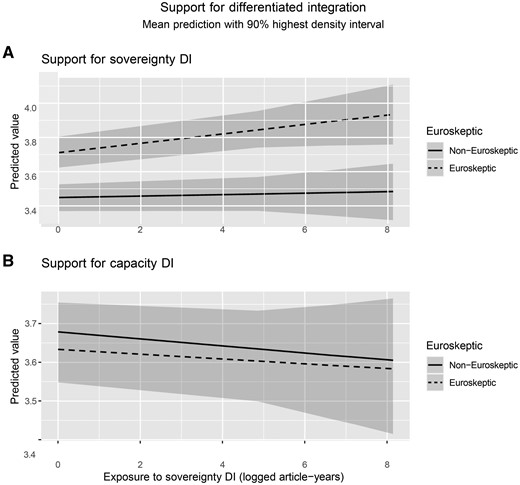

# Peer-reviewed journal articles

## [Opting out of an EU identity? The effect of differentiated integration on European identity](https://martinmoland.github.io/files/JEPP_2024_Moland.pdf){:target="_blank"}

The link between European institutions and European identities remains an under-explored question. Similarly, we know little about how countries opting out of European integration have shaped their citizens' view of themselves as more or less European. Using general synthetic control models and data from $1983-2020$ I find that people in countries with opt-outs tend to identify as more strongly European in the years after an opt-out is implemented, but that this effect can only be described as causal where the opt-outs were the result of bottom-up demand for more sovereignty in specific areas. This shows that providing individual countries with greater autonomy may strengthen their citizens' attachment to Europe, but that any such effect is likely to depend on domestic variations in for instance elite politicization of European integration.

Recommended citation: Moland, M. (2024) 'Opting out of an EU identity? The effect of differentiated integration on European identity', doi: 10.1080/13501763.2024.2402869

## [Past Political Asymmetry and Present Public Opinion: How Has the Asymmetrical Federation of the EU Shaped Popular Opinion of Its Optimal Shape?](https://martinmoland.github.io/files/Moland_2024_Publius.pdf){:target="_blank"}

Asymmetries in the formal obligations and rights afforded to sub-units are mainstays of many federations that have been extensively studied from many angles. However, we know relatively little about how these asymmetries shape views on federalism in the future. By leveraging data on differentiated integration in the European Union (EU), conceptually very similar to asymmetrical federalism, and survey data on attitudes toward the optimal future of it, I show that historical exposure to differentiated integration resulting from a bottom-up process of demands for sub-unit autonomy correlates to increased support for permanent differentiation in the future, especially among those critical of the EU. However, the opposite applies to differentiation imposed by the EU. A legacy of asymmetric federalism may thus breed opposition or support for unitary European federalism, depending on both the mode of past asymmetry that citizens have been exposed to and their views of the EU.

[Link](https://doi.org/10.1093/publius/pjae001){: .btn--research}

Recommended citation: Moland, M. (2024) 'Past Political Asymmetry and Present Public Opinion: How Has the Asymmetrical Federation of the EU Shaped Popular Opinion of Its Optimal Shape?', Publius: The Journal of Federalism, 54(2), pp.361-385.

## [Testing causal inference between social media news reliance and (dis)trust of EU institutions with an Instrumental Variable Approach: Lessons from a null-hypothesis case](https://martinmoland.github.io/files/MolandMichailidou_2023.pdf){:target="_blank"}
Given the well-documented negativity bias and attitudinal entrenchment associated with sharing and debating news in social media, a reasonable and already substantially investigated assumption is that those getting news about the EU mostly from social media would be more sceptical of its institutions than others. Empirical research on this topic has thus far largely deployed experimental and observational methods to investigate this assumption. We contribute to the existing literature with an Instrumental Variable Approach well-suited to establishing causal relationships in non-experimental data. However, we find no blanket causal relationship between relying on social media for news about the EU polity and becoming less trustful of its institutions. EU policies aiming to tackle negative effects of social media news consumption, therefore, need to be tailored to different demographic groups.
[Link](https://doi.org/10.1177/14789299231183574){: .btn--research}

Recommended citation:  
Moland, M. and Michailidou, A. (2023) 'Testing causal inference between social media news reliance and (dis)trust of EU institutions with an Instrumental Variable Approach: Lessons from a null-hypothesis case', *Political Studies Review*, [doi/10.1177/14789299231183574](doi/10.1177/14789299231183574)

## [Opting for opt-outs? National identities and support for a differentiated EU](https://martinmoland.github.io/files/Opting%20for%20opt-outs%20-%20AAM.pdf){:target="_blank"}
A large literature investigates individual support for European integration. However, support for differentiated integration has only recently become an important topic of study for public opinion scholars. Previous literature on this issue has not probed how differentiated integration is shaped by exclusively national identities, and whether the effect varies by how differentiation has been framed. Using survey data from 2020-21, I show that exclusively national citizens are most likely to support differentiated integration that allows for greater national autonomy and may oppose differentiation whose primary goal it is to facilitate further integration. However, I find no clear link between elite framing of differentiated integration and popular support for it. This raises important questions both about what kind of differentiated integration will enjoy public legitimacy and how cues shape support for EU differentiation. 

Recommended citation: Moland, M. (2023) 'Opting for opt-outs? National identities and support for a differentiated EU', *JCMS: Journal of Common Market Studies*, [doi:10.1111/jcms.13478](https://onlinelibrary.wiley.com/doi/abs/10.1111/jcms.13478)

[Replication material](https://dataverse.harvard.edu/dataset.xhtml?persistentId=doi%3A10.7910%2FDVN%2FDPBIG3){: .btn--research}

## [Constraining dissensus *and* permissive consensus: Variations in support for core state powers](https://martinmoland.github.io/files/Accepted%20paper%20-%20WEP.pdf){:target="_blank"}

One of the key features of the post-Maastricht Treaty EU is the increasing contestation of its integration. This is often attributed to the EU’s increasing integration of politically salient policy areas core to state functioning, so-called “core state powers” (CSPs). These are often thought to have features making their integration particularly likely to be contested However, whether this equally applies to all core state powers, and whether those with exclusively national identities express generally identical support for all forms of CSP integration, is under-investigated. Using Eurobarometer data from 2019-2021, this article shows that those with no European identity are more likely to oppose CSP integration where it constrains member states’ domestic, rather than external, autonomy. This implies that an emerging constraining dissensus may be less of a challenge for the EU’s increasing foreign policy integration, but that it may hinder further integration of domestic core state power integration.

Recommended citation: Moland, M. (2022) 'Constraining Dissensus and Permissive Consensus: Variations in Support for Core State Power Integration', *West European Politics*, [doi:10.1080/01402382.2022.2104052](https://www.tandfonline.com/doi/abs/10.1080/01402382.2022.2104052)

# Book chapters

## ‘United, we tweet’: Belonging and solidarity in German and Greek Twitter-spheres
The question of what characterises the European public sphere, and whether one exists in the first place, has been a topic of flourishing academic debate for many years. Concomitant with the rise of social media such as Twitter and Facebook, the focus has shifted to exploring how social media can be used to encourage a European public sphere that is fully transnational in nature. Our paper contributes to this literature by focusing on the transnationalisation of the public sphere in the context of European integration under conditions of crisis. Using a topic modelling approach, we map the topics of German and Greek Twitter-sphere surrounding the refugee crisis of 2015-2016 and the COVID-19 crisis of 2020-2021, exploiting the multilingual nature of Twitter discourses in the two countries to investigate transnationalization and Europeanization of discourses both in domestic-language and English-language tweets in the two countries. We thus bring new empirical analysis to the timely issue of whether the EU’s near-permanent state of crisis in the past and current decade has given rise to a de-differentiated public sphere, whereby Europeans use social media to debate the same topics while applying the same frames of reference, or social media instead continue to serve as an amplifier of national discourses and debates.

Recommended citation: Moland, M. and Michailidou, A. (forthcoming) ‘United, we tweet’: Belonging and solidarity in German and Greek Twitter-spheres. In: Fossum, JE and Batora, J. (eds) *EU Differentiation and the Question of Domination: From the Financial Crisis to COVID-19*, Routledge.

# Working papers and pre-prints

## [Comparing elite and citizen attitudes towards the differentiated implementation of EU law: Evidence from a large-N survey of citizens, politicians and bureaucrats](https://martinmoland.github.io/files/COMPLEX_MOLAND_2024.pdf){:target="_blank"}
Transnational regulatory harmonization is a key building block of the international legal order. However, we know little about how elites and citizen views of regulatory harmonization differ. Using data from a Norwegian survey from 2023 I find both citizen-elite and intra-elite gaps in perceptions of legal harmonization. Future studies into public and elite opinion of international cooperation must thus theorize more clearly how the elite-citizen gap may vary for different elites, and empirically test how these differences manifest across policy areas.

## [News, Misinformation and Support for the EU: Exploring the Effect of Social Media as Polarising Force or Neutral Mediators](https://papers.ssrn.com/sol3/papers.cfm?abstract_id=3889187)
As social media platforms have become a staple news source for many EU citizens, we model repurposed Eurobarometer data from 27 EU member states to explore the possible polarising effects of social media use on public opinion about European integration. In a first step, we investigate whether social media use is correlated with decreased trust in the EU. In a second step, we probe the link between social media news consumption, fake news and polarisation by expanding the cross-sectional analysis with EU level analyses of the interaction between social media use and fake news. Our research paper finds no significant correlation between social media use and increased Euroscepticism at either step. We argue that this lack of significant social media effects at the aggregate level is an argument for why future research on social media effects should incorporate measures of these effects at both the individual and societal level. Thus, while our study focuses on a European context, it holds important lessons for future social media research outside of Europe too.

# Conference presentations and invited talks
## 2022
### ECPR General Conference 2022
Moland, M. (2022) *Does differentiation beget differentiation: Examining the link between exposure to and support for differentiation*[Conference presentation]. ECPR General Conference, Innsbruck, Austria.

### ECPR Standing Group on European Union Biannual Conference 2022
* Presenter: Moland, M. (2022) *Domination and public support for differentiation: Examining the connection between mode of implementation and support for differentiated integration*[Conference presentation].
* Panel chair: "The politicization and mediatization of Europe's differentiated order"

### European Union Studies Association 17th Biannual Conference
Moland, M. (2022) *Opting for opt-outs – Untangling the role of identity in shaping support for differentiated integration*[Conference presentation]. EUSA 17th Biannual Conference, Miami, Florida.

